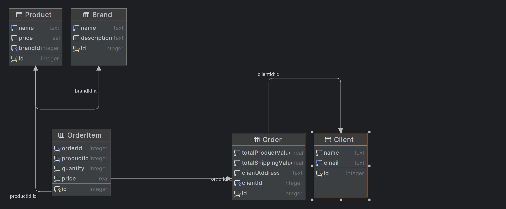

# 🛍️ E-Commerce Project
This project is a backend system for a simple e-commerce application. You can manage brands and products, and simulate product purchase processes. 🎉

# 🚀 Getting Started
This section will guide you on how to get the project up and running on your local machine for development and testing purposes.

Prerequisites
Make sure you have Node.js installed on your local machine before starting.

Installation
Clone the repository:

```
git clone https://github.com/fatihdemircan34/moleculerCommerce4MetamaxCase.git

```
Use code with caution.
Install NPM packages:
```
npm install 
```
Use code with caution.
Start the application:

Install NPM packages:
```
npx prisma migrate dev --name init
npm run seed
npm start 
```
# 📦 Endpoints
Below are the available API endpoints and their descriptions.

**<h4>Brands<h4>**

GET /api/brands: Lists all brands. 🏷️

POST /api/brands: Creates a new brand. 🆕
**<h4>Products<h4>**

GET /api/products:  Lists all products along with brand information. 📦

POST /api/products: Creates a new product. 🆕
**<h4>Checkout<h4>**
POST api/checkout": Simulates a product purchase process. 🛒

# ER Diagram



# 📝 Testing 


```{
  "client": {
    "name": "Ahmet Yılmaz",
    "email": "ahmet@example.com",
    "id":1
  },
 
  "clientAddress": "1234 Sokak No:56, 34000 İstanbul, Türkiye",
  "totalProductValue": 1500,
  "totalShippingValue": 50,
  "products": [
    {
      "productId": 1,
      "quantity": 2,
      "price": 500
    },
    {
      "productId": 2,
      "quantity": 1,
      "price": 500
    }
  ]
}
```

# 🛠️ Built With
Node.js
Moleculer
Prisma
SQLite (As the database)


 
