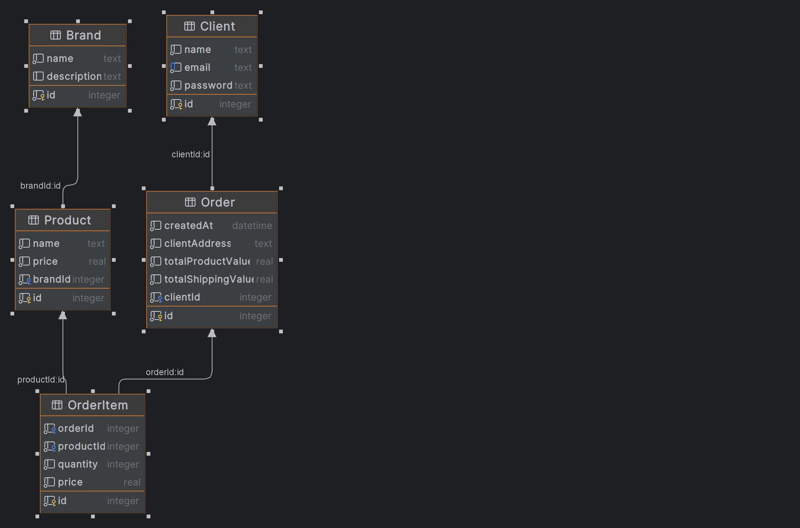

# 🛍️ E-Commerce Project
This project is a backend system for a simple e-commerce application. You can manage brands and products, and simulate product purchase processes. 🎉

# 🚀 Getting Started
This section will guide you on how to get the project up and running on your local machine for development and testing purposes.

Prerequisites
Make sure you have Node.js installed on your local machine before starting.

Installation
Clone the repository:

```
git clone https://github.com/fatihdemircan34/moleculerCommerce4MetamaxCase.git

```
Use code with caution.
Install NPM packages:
```
npm install 
```
Use code with caution.
Start the application:

Install NPM packages:
```
npx prisma migrate dev --name init
npm run seed
npm start 
```
# 📦 Endpoints
# API Endpoints Overview 🚀

This API provides a comprehensive set of functionalities for managing brands, products, clients, and processing orders. Below is a breakdown of the available endpoints and their respective functionalities.

## Auth Routes 🔐

- **POST /api/auth/register**
    - **Description:** Registers a new user account.
    - **Body Parameters:** `email`, `password`, `name` (optional).
    - **Returns:** Confirmation of registration.

- **POST /api/auth/login**
    - **Description:** Authenticates a user and returns a JWT token.
    - **Body Parameters:** `email`, `password`.
    - **Returns:** JWT token for authenticated requests.

## Brand Routes 🏷️

- **GET /api/brands**
    - **Description:** Lists all available brands.
    - **Requires Authentication:** ❌
    - **Returns:** An array of brand objects.

- **POST /api/brands**
    - **Description:** Creates a new brand.
    - **Requires Authentication:** ✅
    - **Body Parameters:** `name`, `description`.
    - **Returns:** The created brand object.

- **PUT /api/brands/:id**
    - **Description:** Updates an existing brand.
    - **Requires Authentication:** ✅
    - **URL Parameters:** `id` - The ID of the brand to update.
    - **Body Parameters:** `name`, `description` (both optional).
    - **Returns:** The updated brand object.

- **DELETE /api/brands/:id**
    - **Description:** Deletes a brand.
    - **Requires Authentication:** ✅
    - **URL Parameters:** `id` - The ID of the brand to delete.
    - **Returns:** Confirmation of deletion.

- **GET /api/brands/:id**
    - **Description:** Retrieves a single brand by ID.
    - **Requires Authentication:** ✅
    - **URL Parameters:** `id` - The ID of the brand to retrieve.
    - **Returns:** The requested brand object.

## Product Routes 📦

- **GET /api/products**
    - **Description:** Lists all products along with their associated brand information.
    - **Requires Authentication:** ❌
    - **Returns:** An array of product objects.

- **POST /api/products**
    - **Description:** Creates a new product.
    - **Requires Authentication:** ✅
    - **Body Parameters:** `name`, `price`, `brandId`.
    - **Returns:** The created product object.

- **PUT /api/products/:id**
    - **Description:** Updates an existing product.
    - **Requires Authentication:** ✅
    - **URL Parameters:** `id` - The ID of the product to update.
    - **Body Parameters:** `name`, `price`, `brandId` (all optional).
    - **Returns:** The updated product object.

- **DELETE /api/products/:id**
    - **Description:** Deletes a product.
    - **Requires Authentication:** ✅
    - **URL Parameters:** `id` - The ID of the product to delete.
    - **Returns:** Confirmation of deletion.

- **GET /api/products/:id**
    - **Description:** Retrieves a single product by ID, including brand information.
    - **Requires Authentication:** ✅
    - **URL Parameters:** `id` - The ID of the product to retrieve.
    - **Returns:** The requested product object.

## Checkout Route 🛒

- **POST /api/checkout**
    - **Description:** Simulates the checkout process for purchasing products.
    - **Requires Authentication:** ✅
    - **Body Parameters:** `clientAddress`, `totalProductValue`, `totalShippingValue`, `products` (array of product objects).
    - **Returns:** Confirmation of the simulated order creation.

# ER Diagram
 


# 📝 Testing 
 


```{
  "client": {
    "name": "Ahmet Yılmaz",
    "email": "ahmet@example.com",
    "id":1
  },
 
  "clientAddress": "1234 Sokak No:56, 34000 İstanbul, Türkiye",
  "totalProductValue": 1500,
  "totalShippingValue": 50,
  "products": [
    {
      "productId": 1,
      "quantity": 2,
      "price": 500
    },
    {
      "productId": 2,
      "quantity": 1,
      "price": 500
    }
  ]
}
```

# 🛠️ Built With
Node.js
Moleculer
Prisma
SQLite (As the database)


 
